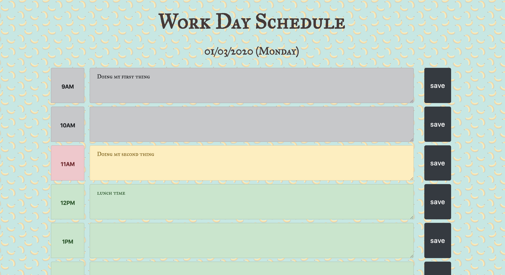

# Banana-WorkDay-Schedule
[Work Day Schedule Deploy Application!](https://yzhao322.github.io/Banana-WorkDay-Schedule/Banana-Workday-Schedule.html) - https://yzhao322.github.io/Banana-WorkDay-Schedule/Banana-Workday-Schedule.html

* This is simple Work Day Planner Application that would allow user to manage their work time from 9 to 5.  the colored theme inspired by Banana. 

* Both passed time block and passed schedule event block will be represented by grey. 
* Current time block will be represented by hot pink and current schedule event block will be represented by yellow.
* Both future time block and schedule event block will be reqpresented by green.
* Click "save" button will upload the user's input schedule to LocalStorage. 
* Reload the page, the uploaded data will be retrieved from LocalStorage.
